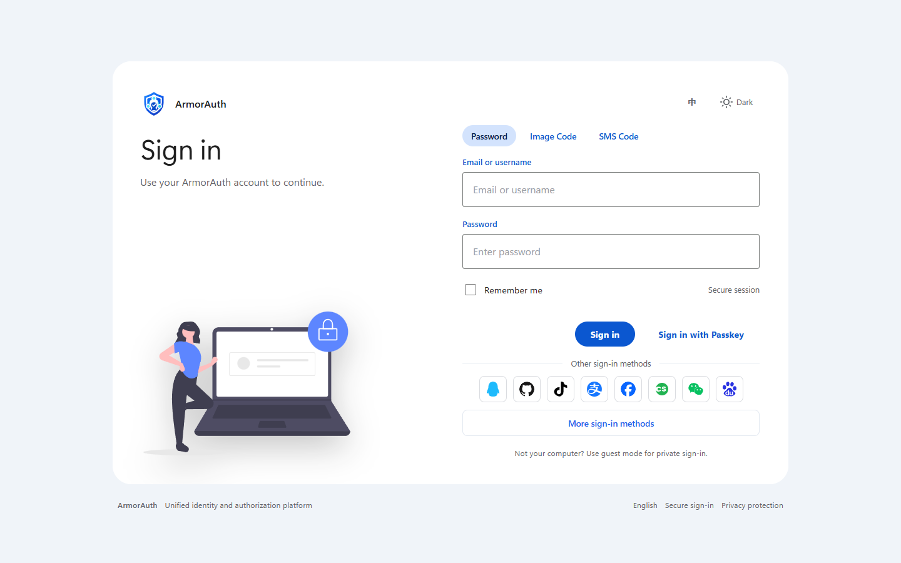

<p align="center">
  
</p>

# ArmorAuth

[简体中文](README.zh-CN.md)

ArmorAuth is a self-hosted identity, authentication, and authorization platform built on Spring Security and Spring Authorization Server. It packages a production-oriented OAuth 2.0 / OpenID Connect authorization server, hosted sign-in pages, an admin API, a Vue admin console, Spring Boot integration starters, and runnable samples in one Java/Spring codebase.

Current version: `1.0.0`



## What ArmorAuth Provides

ArmorAuth is designed for teams that need private deployment and full control over their identity infrastructure without giving up standard protocol compatibility.

- OAuth 2.0 and OpenID Connect authorization server based on Spring Authorization Server.
- Hosted user-facing pages for sign-in, consent, MFA challenge, device activation, account activation result, and federated account confirmation.
- Admin REST API and Vue 3 admin console for operating applications, users, organizations, tenants, identity providers, policies, sessions, keys, audit logs, webhooks, and token statistics.
- Multi-tenant issuer support with tenant-aware paths such as `/t/{tenantCode}`.
- Persistent JWK storage and database-backed authorization, consent, registered client, user, tenant, organization, and identity provider data.
- Secret protection for sensitive data such as identity provider secrets, webhook secrets, TOTP material, and signing keys.

## Authentication Experience

The hosted login flow is built to cover common consumer, enterprise, and internal-platform access patterns.

- Password login with remember-me session support.
- Graphic captcha and SMS one-time-code login flows.
- MFA with TOTP authenticator factors and recovery-code-oriented account security flows.
- Passkey / WebAuthn passwordless sign-in.
- Federated sign-in through OAuth2/OIDC, SAML, LDAP/AD, and built-in social or enterprise providers.
- External account linking and confirmation pages for safely binding federated identities to local users.

## Authorization And Protocol Features

ArmorAuth exposes standard authorization-server endpoints while keeping operational state in your database.

- Authorization Code, Client Credentials, Refresh Token, Device Authorization, introspection, revocation, discovery, JWKS, and OIDC logout surfaces.
- Tenant-aware issuer and token customization.
- Organization-aware ID token and access-token claims such as `tenant_id`, `roles`, `org_ids`, and `org_roles`.
- Optional Dynamic Client Registration and DPoP-related application configuration surfaces.
- SCIM 2.0 user and group provisioning endpoints.
- Authorization-check APIs for application services that need centralized permission decisions.

## Admin Console

The admin console is the operational surface for ArmorAuth.

- Application management: clients, redirect URIs, grant types, authentication methods, scopes, DPoP, MFA policy, and endpoint details.
- User management: account status, profile data, phone/email verification state, roles, and organization membership.
- Tenant and organization management: tenant code, name, branding, domain, status, hierarchical organizations, and member roles.
- Identity providers: OAuth2/OIDC, SAML, LDAP, and built-in providers such as WeChat, WeCom, DingTalk, Feishu, Alipay, QQ, and Gitee.
- Security operations: login policies, sessions, secret protection, JWK keys, MFA/account factors, and Passkey support.
- Observability and integration: audit logs, token statistics, webhooks, and provider/account binding views.

## Spring Boot Integration

The `armorauth-spring-boot-starter` module helps relying services integrate with ArmorAuth using Spring Boot conventions.

- Resource Server auto-configuration.
- OIDC Login auto-configuration.
- Admin API client auto-configuration.
- Security context helpers for user, tenant, role, organization, and token information.
- JWT authority mapping and token relay support for downstream service calls.

See [Spring Boot Starter](docs/spring-boot-starter.md) for integration steps and [Spring Boot Starter Extension Spec](docs/spring-boot-starter-extension-spec.md) for extension points.

## Project Modules

| Module | Purpose |
| --- | --- |
| `armorauth-common` | Shared response, exception, validation, and audit context utilities |
| `armorauth-model` | JPA entities and repositories |
| `armorauth-core` | Authorization server, authentication, MFA, JWK, tenant, secret protection, and persistence adapters |
| `armorauth-federation` | Federated login orchestration, account confirmation, and provider SPI |
| `armorauth-federation-providers` | Built-in provider integrations and provider metadata |
| `armorauth-admin` | Admin, account, SCIM, audit, webhook, and operation REST APIs |
| `armorauth-admin-ui` | Vue 3 management console, served locally by Vite during development |
| `armorauth-server-ui` | Hosted identity pages, styles, scripts, and brand assets |
| `armorauth-server` | Runnable Spring Boot application, default port `9000` |
| `armorauth-spring-boot` | Starter, auto-configuration, and extension support for relying services |
| `armorauth-samples` | Spring Boot and OAuth/OIDC client samples |

## Samples

The sample workspace includes Spring Boot and OAuth/OIDC clients for local integration testing:

- OIDC Login sample.
- Tenant-aware OIDC Login sample.
- Spring Boot PKCE sample.
- OAuth2 client sample.
- PKCE client sample.

## Documentation

| Document | Purpose |
| --- | --- |
| [Product Overview](docs/product-overview.md) | Product positioning, capabilities, and system surfaces |
| [Quick Start](docs/quick-start.md) | Build and run ArmorAuth locally |
| [Basic Usage](docs/basic-usage.md) | First tenant, application, user, MFA, and account-center workflows |
| [Operation Manual](docs/operation-manual.md) | Day-to-day administration and operations |
| [Deployment Guide](docs/deployment-guide.md) | Production deployment, proxy, database, backup, and security guidance |
| [API Reference](docs/api-reference.md) | Admin API, account API, and protocol-adjacent API reference |
| [Spring Boot Starter](docs/spring-boot-starter.md) | Resource Server, OIDC Login, and service integration |
| [Spring Boot Starter Extension Spec](docs/spring-boot-starter-extension-spec.md) | Starter extension points, auto-configuration backoff, current-user context, Admin RestClient, and token relay |
| [OAuth2/OIDC Concepts](docs/oauth2-oidc-concepts.md) | Protocol concepts for teams integrating relying applications |
| [Federation Configuration](docs/federation-config.md) | OAuth2/OIDC, SAML, LDAP, and provider setup |
| [MFA Configuration](docs/mfa-config.md) | MFA, TOTP, Passkey, and application policy setup |
| [Security Best Practices](docs/security-best-practices.md) | Security checklist and hardening notes |
| [Development Seed Profile](docs/mock-system.md) | Local development seed data for demos and UI/API exploration |

## Requirements

- JDK 21+
- Maven 3.9+
- MySQL 8.0+ for shared or production-like environments
- Node.js 18+ for admin console development

## Build From Source

```bash
mvn -pl armorauth-server -am package -DskipTests
```

The runnable server artifact is produced at:

```text
armorauth-server/target/armorauth-server-1.0.0.jar
```

Run it with:

```bash
java -jar armorauth-server/target/armorauth-server-1.0.0.jar
```

The admin console development server runs on port `1080` and proxies API requests to `localhost:9000`:

```bash
cd armorauth-admin-ui
npm install
npm run dev
```

## Security Notes

ArmorAuth stores signing keys and sensitive integration secrets in the database. Production deployments should use stable encryption keys, a stable issuer URL, HTTPS-only cookies, restricted admin access, and database backups that include JWK and secret-protection data.

Default development credentials and seed data are for local development only.

## License

Apache License 2.0
