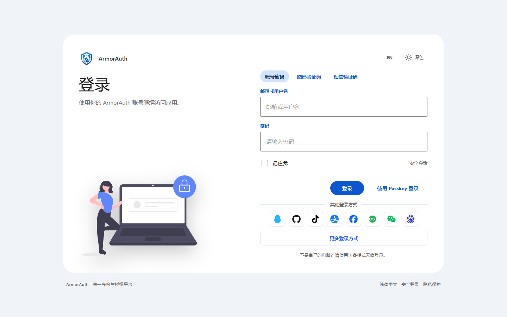

<p align="center">
  
</p>

# ArmorAuth

[English](README.md)

ArmorAuth 是一个基于 Spring Security 与 Spring Authorization Server 构建的自托管身份认证与授权平台。它把 OAuth 2.0 / OpenID Connect 授权服务器、托管登录页、管理 API、Vue 管理控制台、Spring Boot 接入 Starter 和示例工程整合在一个清晰的 Java/Spring 代码库中，适合私有化部署、二次开发和平台化集成。

当前版本：`1.0.0`



## ArmorAuth 能做什么

ArmorAuth 面向需要掌控身份基础设施的产品团队和平台工程团队：既保留标准协议兼容性，又能将用户、租户、组织、密钥、登录策略和身份源数据掌握在自己的系统里。

- 基于 Spring Authorization Server 的 OAuth 2.0 与 OpenID Connect 授权服务器。
- 托管身份页面：登录、授权确认、MFA 挑战、设备激活、激活结果、联合身份确认。
- 管理 REST API 与 Vue 3 管理控制台：应用、用户、组织、租户、身份源、策略、会话、密钥、审计、Webhook、Token 统计。
- 多租户 issuer 支持，支持 `/t/{tenantCode}` 这样的租户路径。
- JWK、授权、同意、客户端、用户、租户、组织、身份源等数据持久化到数据库。
- 敏感数据保护：身份源密钥、Webhook 密钥、TOTP 材料、签名私钥等可加密保存。

## 登录与账号安全

托管登录页覆盖常见的消费者、企业和内部平台登录场景。

- 账号密码登录与记住我会话。
- 图形验证码登录、短信一次性验证码登录。
- MFA：TOTP 身份验证器、账号安全因子和恢复码相关流程。
- Passkey / WebAuthn 无密码登录。
- OAuth2/OIDC、SAML、LDAP/AD 以及内置社交/企业身份源联合登录。
- 外部账号绑定与确认页面，用于将第三方身份安全绑定到本地账号。

## 授权与协议能力

ArmorAuth 对外提供标准授权服务器端点，同时将运行状态落库，便于审计、备份和运维。

- Authorization Code、Client Credentials、Refresh Token、Device Authorization、introspection、revocation、discovery、JWKS、OIDC logout 等能力。
- 租户感知 issuer 与 Token 定制。
- 组织感知声明，可在 Token 中注入 `tenant_id`、`roles`、`org_ids`、`org_roles` 等信息。
- 动态客户端注册与 DPoP 相关应用配置能力。
- SCIM 2.0 用户与组同步接口。
- 授权检查 API，便于业务服务集中判定用户权限。

## 管理控制台

管理控制台是 ArmorAuth 的日常运营入口。

- 应用管理：Client、回调地址、授权类型、认证方式、Scope、DPoP、MFA 策略和端点详情。
- 用户管理：账号状态、基础资料、手机号/邮箱验证状态、角色、组织归属。
- 租户与组织：租户编码、名称、品牌、域名、启停状态、层级组织和成员角色。
- 身份源：OAuth2/OIDC、SAML、LDAP，以及微信、企业微信、钉钉、飞书、支付宝、QQ、Gitee 等内置 Provider。
- 安全运营：登录策略、会话管理、Secret 保护、JWK 密钥、MFA 因子、Passkey 支持。
- 监控集成：审计日志、Token 统计、Webhook、外部账号绑定视图。

## Spring Boot 接入

`armorauth-spring-boot-starter` 面向接入方 Spring Boot 服务，降低资源服务器和 OIDC Login 集成成本。

- Resource Server 自动配置。
- OIDC Login 自动配置。
- Admin API Client 自动配置。
- 用户、租户、角色、组织、Token 信息的安全上下文工具。
- JWT 权限映射与下游服务 Token Relay。

接入步骤详见 [Spring Boot Starter](docs/spring-boot-starter.md)，扩展点详见 [Spring Boot Starter 扩展规格](docs/spring-boot-starter-extension-spec.md)。

## 模块结构

| 模块 | 说明 |
| --- | --- |
| `armorauth-common` | 通用响应、异常、校验、审计上下文等基础能力 |
| `armorauth-model` | JPA 实体与 Repository |
| `armorauth-core` | 授权服务器、认证、MFA、JWK、租户、密钥保护和持久化适配 |
| `armorauth-federation` | 联合登录编排、账号确认、Provider SPI |
| `armorauth-federation-providers` | 内置 Provider 集成与元数据 |
| `armorauth-admin` | 管理、账户、SCIM、审计、Webhook 和运营 REST API |
| `armorauth-admin-ui` | Vue 3 管理控制台，开发时由 Vite 启动 |
| `armorauth-server-ui` | 托管身份页面模板、样式、脚本和品牌资源 |
| `armorauth-server` | 可独立运行的 Spring Boot 服务，默认端口 `9000` |
| `armorauth-spring-boot` | 面向接入方服务的 Starter、自动配置和扩展支持 |
| `armorauth-samples` | Spring Boot 与 OAuth/OIDC 客户端样例 |

## 示例工程

`armorauth-samples` 提供本地联调用的接入样例：

- OIDC Login 示例。
- 租户感知 OIDC Login 示例。
- Spring Boot PKCE 示例。
- OAuth2 Client 示例。
- PKCE Client 示例。

## 文档

| 文档 | 说明 |
| --- | --- |
| [产品概览](docs/product-overview.zh-CN.md) | 产品定位、核心能力和系统入口 |
| [快速开始](docs/quick-start.zh-CN.md) | 本地构建和运行 ArmorAuth |
| [基础使用](docs/basic-usage.zh-CN.md) | 租户、应用、用户、MFA 和账号中心的基础流程 |
| [操作手册](docs/operation-manual.zh-CN.md) | 日常管理与运营流程 |
| [部署指南](docs/deployment-guide.zh-CN.md) | 生产部署、反向代理、数据库、备份与安全配置 |
| [API Reference](docs/api-reference.md) | 管理 API、账户 API 和协议相关 API |
| [Spring Boot Starter](docs/spring-boot-starter.md) | 资源服务器、OIDC Login 与业务服务接入 |
| [Spring Boot Starter 扩展规格](docs/spring-boot-starter-extension-spec.md) | Starter 扩展点、自动配置让位、当前用户上下文、Admin RestClient 和 Token Relay |
| [OAuth2/OIDC 概念](docs/oauth2-oidc-concepts.md) | 接入应用需要理解的协议基础概念 |
| [联合登录配置](docs/federation-config.md) | OAuth2/OIDC、SAML、LDAP 与 Provider 配置 |
| [MFA 配置](docs/mfa-config.md) | MFA、TOTP、Passkey 与应用策略 |
| [安全最佳实践](docs/security-best-practices.md) | 安全加固与检查清单 |
| [开发种子 Profile](docs/mock-system.zh-CN.md) | 本地开发、演示和 UI/API 探索用种子数据 |

## 环境要求

- JDK 21+
- Maven 3.9+
- MySQL 8.0+，用于共享环境或接近生产的部署
- Node.js 18+，用于管理控制台开发

## 从源码构建

```bash
mvn -pl armorauth-server -am package -DskipTests
```

服务端产物位于：

```text
armorauth-server/target/armorauth-server-1.0.0.jar
```

启动服务：

```bash
java -jar armorauth-server/target/armorauth-server-1.0.0.jar
```

管理控制台开发服务默认运行在 `1080`，并把 API 请求代理到 `localhost:9000`：

```bash
cd armorauth-admin-ui
npm install
npm run dev
```

## 安全说明

ArmorAuth 会在数据库中保存签名密钥和敏感集成密钥。生产环境应配置稳定的加密密钥、稳定的 issuer URL、HTTPS Cookie、受控的管理员访问，以及包含 JWK 和密钥保护数据的备份方案。

默认开发凭据和种子数据只适合本地开发，不应进入共享或生产环境。

## License

Apache License 2.0
